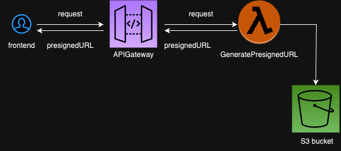
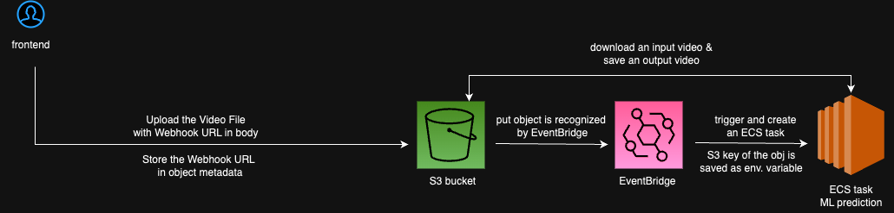
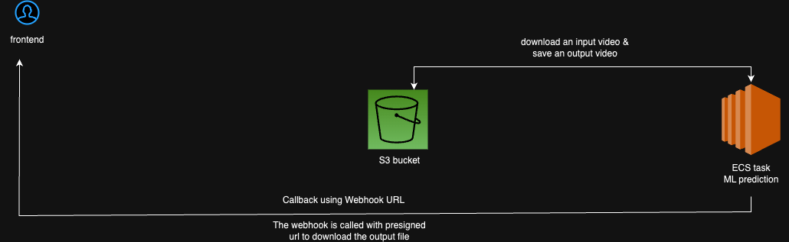

# Human Action Recognition

A service that predicts human action in a video using pre-trained [Resnet 3D](https://github.com/kenshohara/3D-ResNets-PyTorch/blob/master/models/resnet.py) PyTorch models. Deployed on AWS Cloud using ECS, S3, EventBridge, and lambda. 

https://github.com/mie-h/human-action-recognition/assets/56993977/1975c775-f002-4511-9bbd-f802cf5523f4

<!-- Example output 1: 

basketball

video here
need to reduce the video size

Example output 2: archery

video here
need to reduce the video size -->

# 🌟 How It Works

Get S3 presigned URL with from API Gateway, and upload an input video to S3 bucket using the presigned URL.

Put operation on S3 is logged with CloudTrail. Eventbridge rule recognizes the put object log and starts a new ECS task.

The triggered and initialized ECS task does the human action recognition prediction using pre-trained Pytorch model, and saves the output to S3 bucket. 

# 🏃🏻‍♀️ Usage

I implemented [a simple client side code](https://github.com/mie-h/human-action-recognition/blob/main/client/client_app.py) using FastAPI. Please refer to this page for how to use this service. 

# 💭 Thoughts and Optimization

<!-- free campus. be as creative as you want :D -->

* Both input and output videos are saved in the same S3 bucket. For the EventBridge rule on S3 PUT OBJECT, input and output videos should be in the separate buckets to avoid infinite cycle for the best practice.
<!-- * thoughts on Volume/Scale/QPS/latency -->

* Scalability
    * Currently, ECS task is created every time an input video is uploaded to S3 bucket and exits after the Machine Learning prediction and processing is done. For higher availability of processing in ECS, deploy an ECS task so that it continuously listen to incoming requests 
    * Lambda function that provides presiged url and S3 bucket for video storage are highly scalable.
* Latency
    <!-- * time it takes to process a video of size ... is ... -->
    * With webhook url, the client side does not have to wait for the processing completion.
       * The frontend provides a webhook url as well as an input video to S3, then the rest of the processing is done asynchronously. For more detail, look at [client_app.py](https://github.com/mie-h/human-action-recognition/blob/main/client/client_app.py)
       * Without the webhook url, it takes at least a few minutes to complete the processing.   
    * Multi-part upload can improve the performance of video upload.
    * Reduce the cold strat time of AWS lambda with provisioned concurrency.
* QPS
    * max. number of concurrent lambda function invocation is 1000 per AWS Region. 
    

# 💡 Things I learned
* [Passing S3 PutObject event data to ECS task](https://github.com/mie-h/passing-event-data-ecs-task/tree/main)
* [multipart upload + presigned url](https://github.com/mie-h/multipart-upload-presignedurl)
* Using [PyTorch model](https://pytorch.org/vision/stable/models.html)
<!-- write about with and without multipart upload -->

